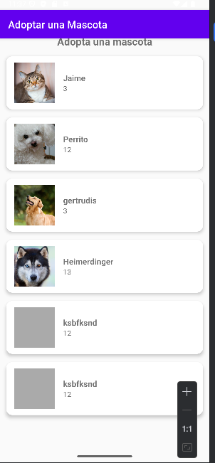
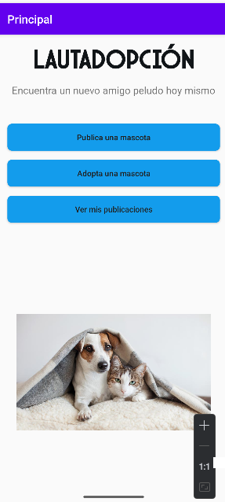

# LautAdopción 🐾

Una aplicación Android para ayudar a adoptar y publicar mascotas perdidas o disponibles para adopción.

## 📱 Funcionalidades
- Iniciar sesión / Registrarse con Firebase
- Publicar mascotas con imagen y detalles
- Ver listado de mascotas disponibles
- Mis publicaciones

## 🧑‍💻 Autores
- Cintya Ram – [@CintyaRam](https://github.com/CintyaRam )

## 🛠️ Tecnologías usadas
- Kotlin
- Firebase Auth + Realtime Database
- Glide
- ConstraintLayout

## 📷 Capturas de pantalla

